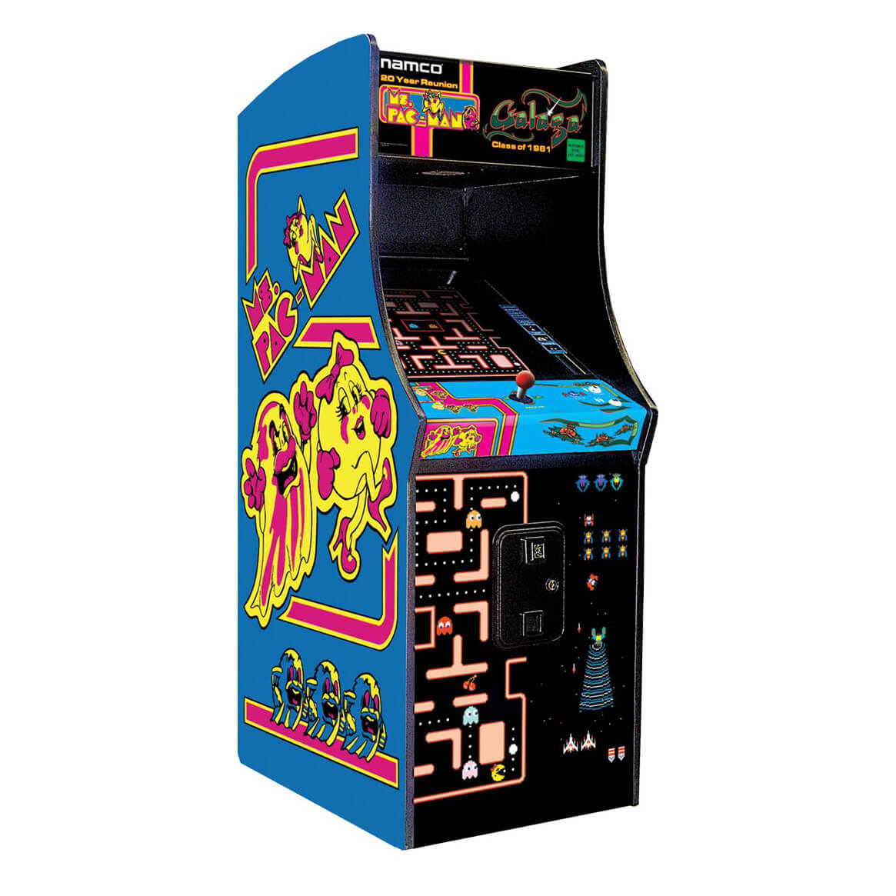
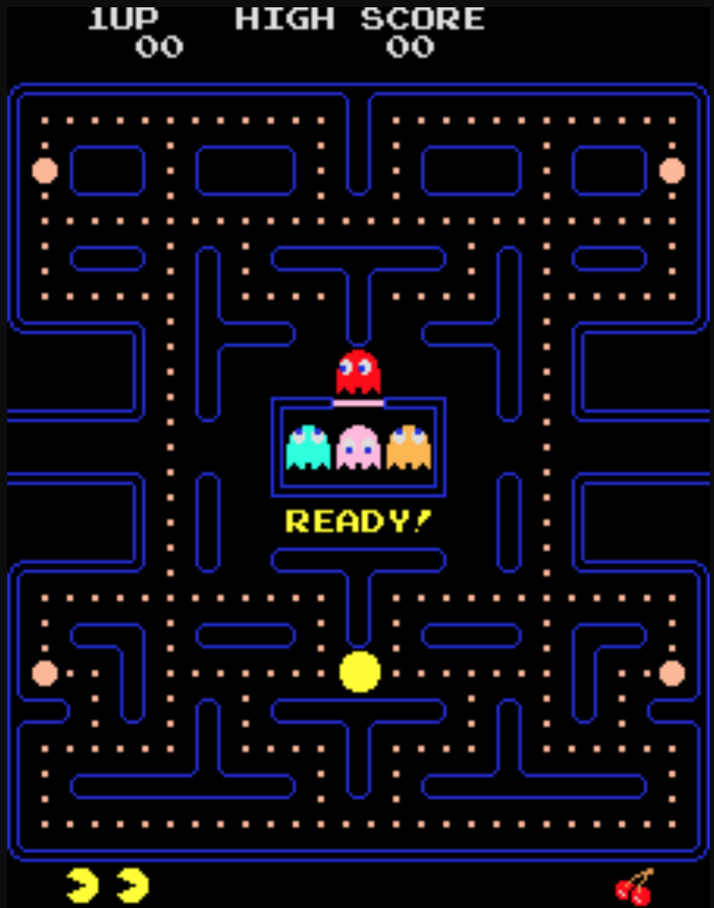

:source-highlighter: prettify

= Groovy Pacman
Frank van Westerop <https://github.com/fvanwesterop[@fvanwesterop]>
ifdef::env-github,env-browser[:outfilesuffix: .adoc]

:javagamestutorial: http://zetcode.com/tutorials/javagamestutorial/
:pacman: http://zetcode.com/tutorials/javagamestutorial/pacman/
:pacman-addicts: https://sites.google.com/site/pacmangamearcade/
:openjfx: https://openjfx.io/
:javafx-game-dev: https://gamedevelopment.tutsplus.com/tutorials/introduction-to-javafx-for-game-development--cms-23835

== Origin

Groovy Pacman is based on a fairly simple Java implementation of the famous 80's game Pacman. The original sources stem
from the {javagamestutorial}[Java 2D Games Tutorial] on zetcode.com, which contains and explains implementations of a
number of classic games, aside from a rudimentary version of {pacman}[Pacman]. Definitely worth a
{javagamestutorial}[visit]!

== Plans

=== base version
The idea is to start-off with Zetcode's Java 2D tutorial version and transform it into a nice playable game that
eventually will run on an Arcade Game console such as in figure 1.

.example cabinet

The hardware part will be an interresting project on
it's own, involving building a cabinet from wood, paint it properly and assemble the electronics probably using a RPi
and buttons and stuff from Adafruit or a similar shop. The original Zetcode implementation of the game is fairly limited
though. The original Arcade version from the 80's is far more advanced from a functional perspective. So I'd like to
bring back in the missing functional elements as well, apart from the technical porting of the game.

.example display

=== ghosts
The original 80's Pacman had four distinct ghosts named Blinky (the red one), Inky (blue), Pinky (pink, obviously) and
Clyde (orange). They all had distinctive behaviour when chasing Pacman. I'd like to put those behaviours back in. And
replace the simple white sprites for the original sprites, including moving eyes ofcourse. Furthermore there is only one
level at the moment, utilizing a (too) simple maze. Would be nice to have multiple levels and mazes that look more like
the original game. Big help to reconstruct both maze and ghosts is the {pacman-addicts}[Pacman addicts corner] site.

=== rewrite procedural code
The original Zetcode sources are written in a rather procedural manner: it's just two files basically, called Game and
Board. The Game 'class' actually just contains some bootstrap code and the entire game itself is contained in the Board
class. We can do a lot better that that, using object-oriented and functional paradigms where appropriate.

=== port to OpenJFX
The GUI code of the original Zetcode sources use old-school Java Swing libraries. Nowadays locally running GUI's are
out-of-fashion anyway, but for games it still makes sense. However Swing really is outdated by now. Maybe nice to give
it's successor a try which is nowadays {openjfx}[OpenJFX], since Oracle donated the JavaFX part of the JDK to the the
OpenJDK project. However in the Java8 SDK JavaFX classes are still there so ot seems we do not need extra libs to get
started. I'll checkout this {javafx-game-dev}[intro to JavaFX for game development] and take it from there.

=== game distribution
The gradle build will create a TAR and/or ZIP distribution containing a convenient start script to run the game. Just take the TAR or ZIP, unpack it wherever you want and run the script for your system from a terminal window.

Additionally, you will find a bunch of helpfull scripts in the `script`-folder:

==== build-and-run-distro.sh
This script will do exactly as described above: It will create and extract the distribution TAR file and run it from there.

==== create-macos-app.sh
This script will take the TAR distribution and convert it into a macOS executable, including a trimmed-down JDK
based on the JDK used to build the application. You may need to change the `sdkVersion`-variable to match the JDK you
want to use to build against. The script uses SDKman to temporarily activate that particular JDK during the build.

If that JDK is currently not available on your system, sdkman will tell you, and suggests the command to install it.) The script
relies on `sdkman` and `jpackage`. If either one is missing, it will supply suggestions on how to get it.

When you are on another platform (Windows, Linux...) you should be able to tweak the script to produce a suitable executable
for your platform as well. Just find the `tools` manual for your JDK online and check the platform specific settings you need.

==== upload-to-rpi.sh
This script will take the TAR distribution and upload and unpack it on your Raspberry PI. This suits my needs to deploy
it on the RPI I use in the Arcade cabinet I want to build. You may want to edit the paths I used to you liking.

== Things to do

=== technical stuff
 - Port to Groovy 2.5 or 3.0, just for fun. Porting to Groovy 3 would also require JDK 9+
 - Refactor the code a bit since it does not really separates concerns very well
 - Port the GUI part from Swing to (Open) JavaFX
 - Try out JWS

=== funtional stuff
 - get rid of the simple default ghost and introduce the original Blinky and friends
 - Extend the maze since it is a bit small right now
 - Add levels, since there is only one in the original
 - Add sound effects, since the original game does not have any sounds
